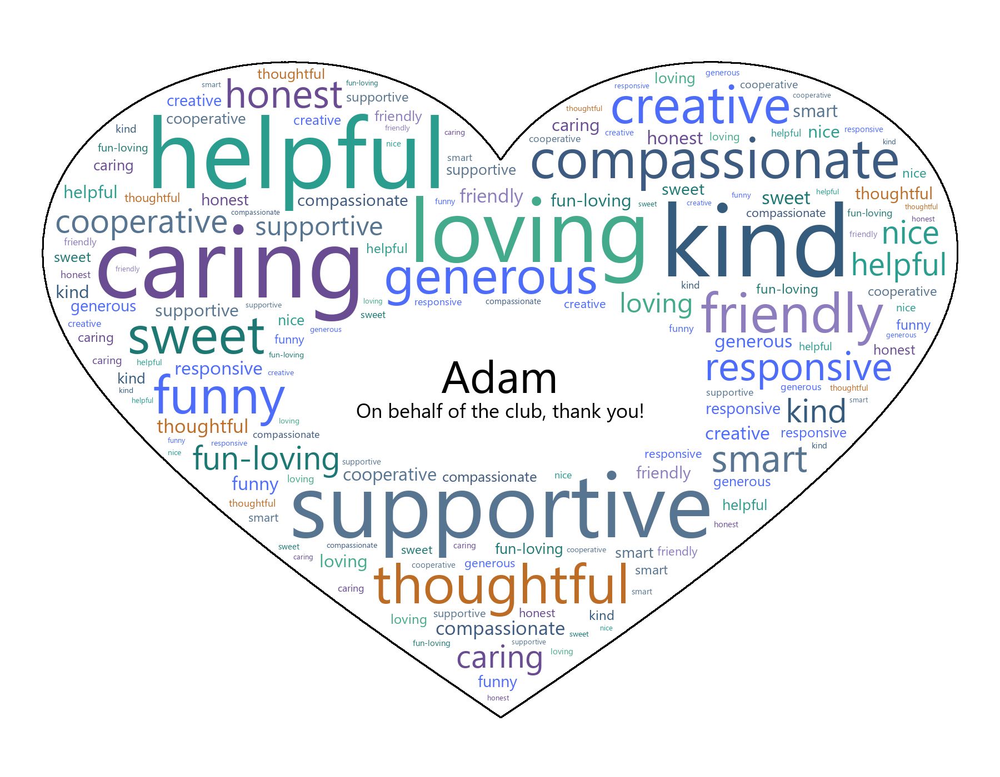

# WordCloudGenerator

WordCloudGenerator is a portable desktop-style app for creating personalized word cloud gifts. It is designed for appreciation cards, graduation gifts, club send-offs, classroom gifts, team gifts, and other personalized keepsakes.

The app lets you enter a recipient name, a short message, a custom weighted word list, a shape mask, and a custom color palette. It then generates a downloadable PNG word cloud that can be printed, framed, or shared digitally.

## Sample Output



## Features

* Create personalized word cloud gifts
* Add a recipient name and custom message
* Use weighted words to control word size
* Upload custom shape masks
* Use built-in color palettes
* Create custom palettes with color pickers
* Adjust layout, word spacing, center hole size, and font sizing
* Export the final design as a PNG
* Portable Windows release available
* No Python installation required for the Windows release

## Download

Go to the latest GitHub Release and download:

`WordCloudGenerator-Windows.zip`

## How to Use on Windows

1. Download `WordCloudGenerator-Windows.zip`.
2. Right-click the ZIP file and choose **Extract All**.
3. Open the extracted folder.
4. Double-click `WordCloudGenerator.exe`.
5. The app will open in your browser.
6. Enter your words, recipient name, message, and design settings.
7. Click **Generate**.
8. Download the final PNG.

No Python installation is required when using the Windows release.

## Word List Format

Words can be entered one per line:

```text
kind
helpful
creative
supportive
```

You can also add weights using `word,weight`:

```text
kind,5
helpful,4
creative,3
supportive,3
funny,2
```

Higher weights make words appear larger in the final word cloud.

## Shape Masks

You can upload a custom mask image to control the shape of the word cloud.

For best results, use a simple black-and-white image:

* Black area = where words can appear
* White area = blocked area
* Simple shapes work best
* Avoid thin outlines or highly detailed logos

Example shapes:

* Heart
* Star
* Graduation cap
* Club logo silhouette
* Team symbol

## Running from Source

Install Python 3.10, then run:

```powershell
py -3.10 -m venv .venv
.\.venv\Scripts\python.exe -m pip install --upgrade pip
.\.venv\Scripts\python.exe -m pip install -r requirements.txt
.\.venv\Scripts\python.exe launcher.py
```

## Building the Windows App

```powershell
.\.venv\Scripts\python.exe -m PyInstaller `
  --noconfirm `
  --clean `
  --onedir `
  --windowed `
  --name "WordCloudGenerator" `
  --icon "assets/icon.ico" `
  --add-data "streamlit_app.py;." `
  --add-data "masks;masks" `
  --add-data "assets;assets" `
  --collect-data streamlit `
  --collect-submodules streamlit `
  --copy-metadata streamlit `
  --collect-all wordcloud `
  --exclude-module IPython `
  --exclude-module ipykernel `
  --exclude-module jupyter `
  --exclude-module notebook `
  --exclude-module scipy `
  --exclude-module sklearn `
  --exclude-module torch `
  --exclude-module tensorflow `
  --exclude-module cv2 `
  --exclude-module seaborn `
  --exclude-module plotly `
  launcher.py
```

After building, the portable app will be located at:

```text
dist/WordCloudGenerator/
```

To create a ZIP release:

```powershell
Compress-Archive `
  -Path "dist/WordCloudGenerator/*" `
  -DestinationPath "WordCloudGenerator-Windows.zip" `
  -Force
```

## Project Structure

```text
WordCloudGenerator/
├── launcher.py
├── streamlit_app.py
├── requirements.txt
├── README.md
├── LICENSE
├── assets/
│   └── icon.ico
├── masks/
│   └── heart.png
├── docs/
│   └── sample-output.png
└── .github/
    └── workflows/
        └── build-windows.yml
```

## License

This project is licensed under the GNU General Public License v3.0.

See the `LICENSE` file for details.
